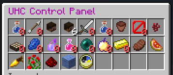
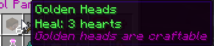

UHC
===

This is a plugin to help run games of UltraHardcore.

This plugin is developed for Spigot 1.8+ and Java 7+.

## Other Useful Plugins

- [FancyFreeze](https://github.com/Eluinhost/FancyFreeze/releases) - Freezes players in an area where they can't move
out of it, give/take damage, heal e.t.c.

- [Scatterer](https://github.com/Eluinhost/Scatterer/releases) - Scatter players across the map, solo or by teams.

# Modules

This plugin offers multiple modules. Each module has an 'icon' in the UHC inventory that can be opened via `/uhc` or 
`/uhc show`

Example view of the inventory:



Hovering over the icon will show the status + configuration of the module:



If you have permission and the module is disableable you can click on the icon
to toggle the enabled status of the module.

List of modules provided by the plugin:

- [HardDifficulty](docs/modules/HardDifficulty.md)
- [HealthRegen](docs/modules/HealthRegen.md)
- [GhastTears](docs/modules/GhastTears.md)
- [GoldenCarrotRecipe](docs/modules/GoldenCarrotRecipe.md)
- [GlisteringMelonRecipe](docs/modules/GlisteringMelonRecipe.md)
- [NotchApples](docs/modules/NotchApples.md)
- [Absorption](docs/modules/Absorption.md)
- [ExtendedSaturation](docs/modules/ExtendedSaturation.md)
- [PVP](docs/modules/PVP.md)
- [EnderpearlDamage](docs/modules/EnderpearlDamage.md)
- [WitchSpawns](docs/modules/WitchSpawns.md)
- [Nether](docs/modules/Nether.md)
- [DeathBans](docs/modules/DeathBans.md)
- [AutoRespawn](docs/modules/AutoRespawn.md)
- [Timer](docs/modules/Timer.md)
- [HardcoreHearts](docs/modules/HardcoreHearts.md)
- [PercentHealth](docs/modules/PercentHealth.md)
- [Tier2Potions](docs/modules/Tier2Potions.md)
- [SplashPotions](docs/modules/SplashPotions.md)
- [GoldenHeads](docs/modules/GoldenHeads.md)
- [HeadDrops](docs/modules/HeadDrops.md)
- [TeamManager](docs/modules/TeamManager.md)

Each module has the a section in the config.yml like this:

```yaml
modules:
  harddifficulty:
    ... etc ..
  healthregen:
    ... etc ...
```

All modules have a configuration option:

```yaml
load: true
```

If this is set to false then the module is not even loaded on plugin startup and will not show up
in the game. Use this to remove any modules you don't want to run at all.

Any disableable modules will also contain:

```yaml
enabled: true 
```

This is the initial state to set the module to after loading. Any changes via the [uhc command](TODO) or via the conifg
inventory will be saved to this option so changes are saved across saves/reloads.

## Commands

[Information on commands with flags](docs/commands/Commands.md)

- [Team Commands](docs/commands/teams/TeamCommands.md)
- [Player Reset Commands](docs/commands/PlayerResetCommands.md)
- [/timer](docs/commands/timer.md)
- [/showhealth](docs/commands/showhealth.md)
- [/ghead](docs/commands/ghead.md)
- [/border](docs/commands/border.md)
- [/uhc](docs/commands/uhc.md)
- [/tpp](docs/commands/tpp.md)