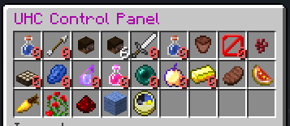
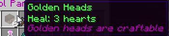

# `/uhc`

Handles showing/enabling/disabling modules

## `/uhc` / `/uhc show`

Shows the uhc configuration inventory.

Clicking on the disableable modules will toggle their state (if you have the correct permission)

## `/uhc enable|disable|toggle <module ids>`

Enables/disables/toggles the given modules

e.g. `/uhc enable harddifficulty goldenheads` will enable both HardDifficulty and GoldenHeads

## Permissions

`uhc.command.uhc` - allows use of `/uhc` and `/uhc show` to view inventory, default true

`uhc.command.uhc.admin` - allows to enable/disable/toggle via inventory and commands, default OP