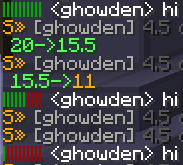

ChatHealth
==========

The icon for this module is a name tag.

When enabled this module will show ooloured bars before your chat messages to represent your health. This is the
health of the player as a percentage.

