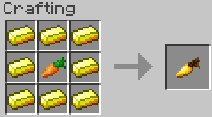
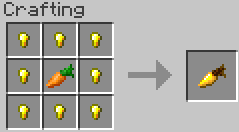

GoldenCarrotRecipe
==================

The icon for this module is golden carrot.

When enabled the recipe for a golden carrot requires ingots to craft:

When disabled it requires nuggets (vanilla recipe):

