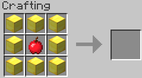

NotchApples
===========

The icon for this module is a Notch apple.

When enabled, allows crafting of Notch apples. NOTE: If running a 1.9+ server, this will add the old recipe back.

When disabled, disables crafting of Notch apples.

